# AWS Multi-Tier Web Application Project

## Project Summary
Designed and deployed a scalable multi-tier web application using AWS.  
- Created a custom VPC with secure public and private subnets across multiple Availability Zones.  
- Configured EC2 instances, Application Load Balancer, and Auto Scaling for high availability.  
- Ensured cost efficiency with dynamic scaling and resource monitoring via CloudWatch.  

### Tools Used:
- AWS (VPC, EC2, ALB, Auto Scaling, CloudWatch)
- Bash Scripting
- Security Groups
- Apache Web Server

---

## Project Description
This project demonstrates the deployment of a scalable multi-tier web application using AWS services. It includes a custom VPC, public and private subnets, EC2 instances, a load balancer, and auto-scaling.

---

## Project Architecture
The project architecture consists of:
- **Custom VPC:** With public and private subnets across two Availability Zones.
- **EC2 Instances:** Running a simple web server with Apache.
- **Application Load Balancer (ALB):** For distributing traffic across instances.
- **Auto Scaling:** For dynamic scalability.

---

## Steps to Implement

### Step 1: Create a Custom VPC
- Created a custom VPC with a CIDR block of `10.0.0.0/16`.
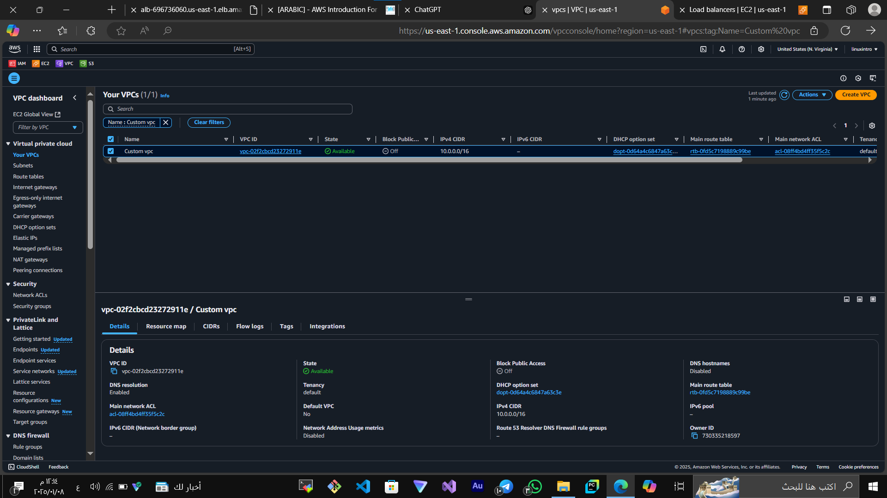

### Step 2: Configure Internet Gateway (IGW)
- Attached an IGW to the VPC for internet connectivity.
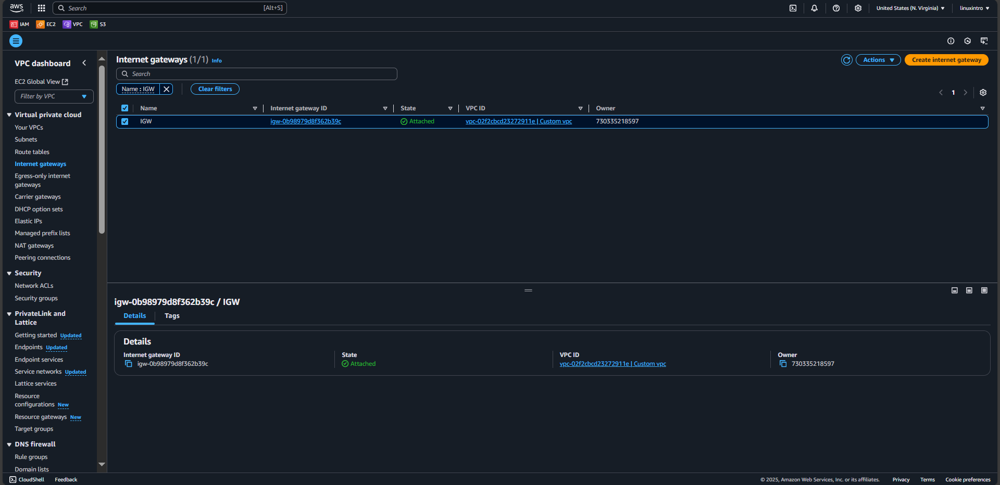

### Step 3: Configure Public and Private Subnets
- Added two public and two private subnets across different availability zones.
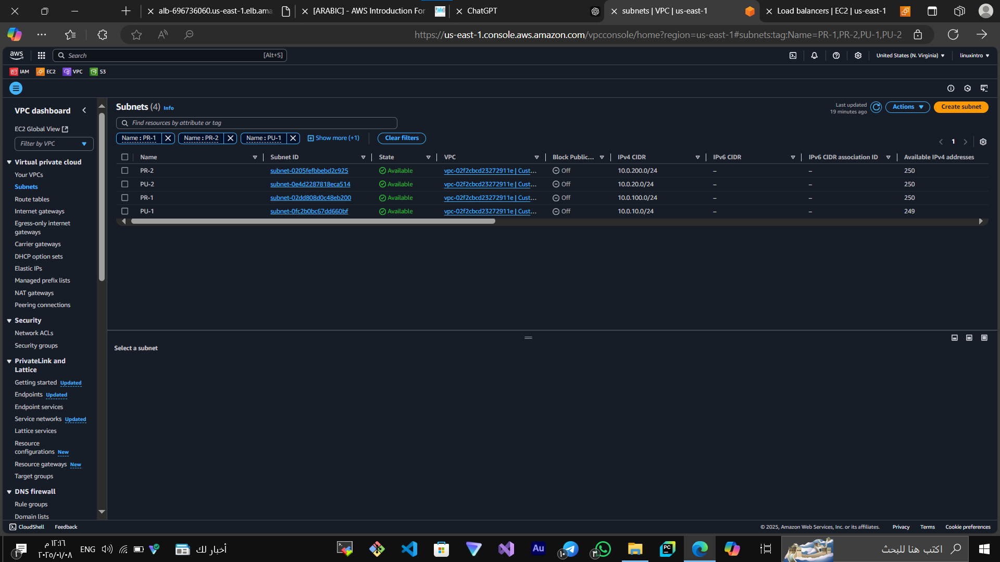

### Step 4: Create Route Tables
- Configured route tables for public and private subnets.
  - Public Route Table:
  
  - Private Route Table:
  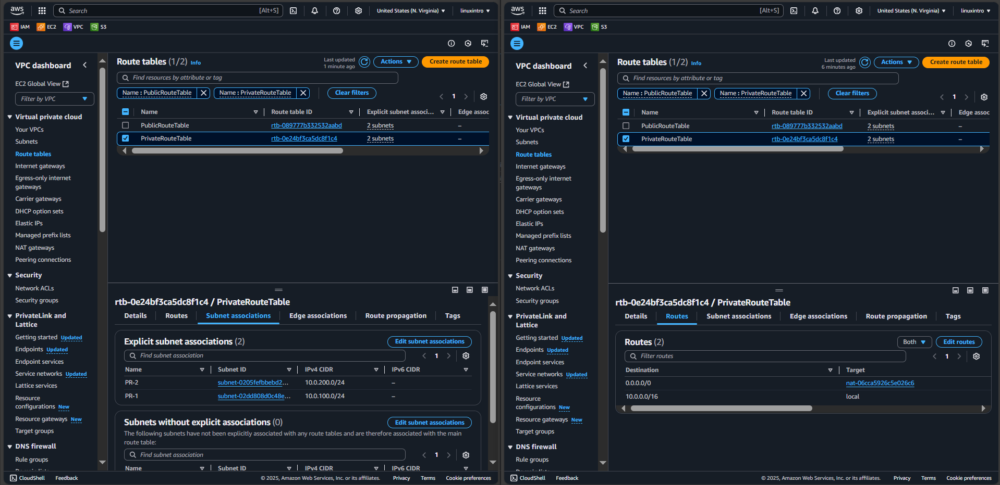

### Step 5: Configure a NAT Gateway
- Created a NAT Gateway for enabling internet access for instances in private subnets.
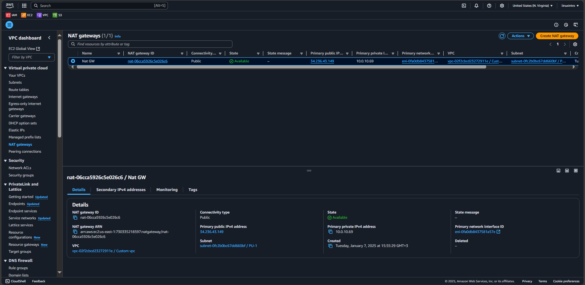

### Step 6: Create Security Groups
- Configured security groups to allow traffic between subnets and restrict unnecessary access.
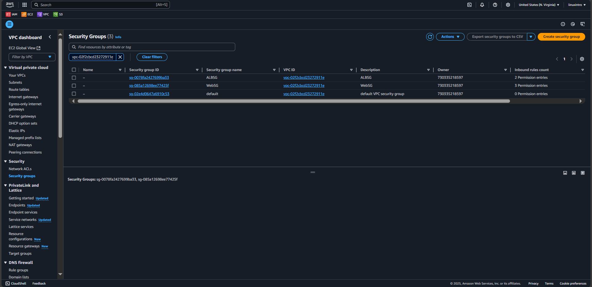

### Step 7: Launch EC2 Instances
- Launched two EC2 instances in the private subnets with Apache installed.
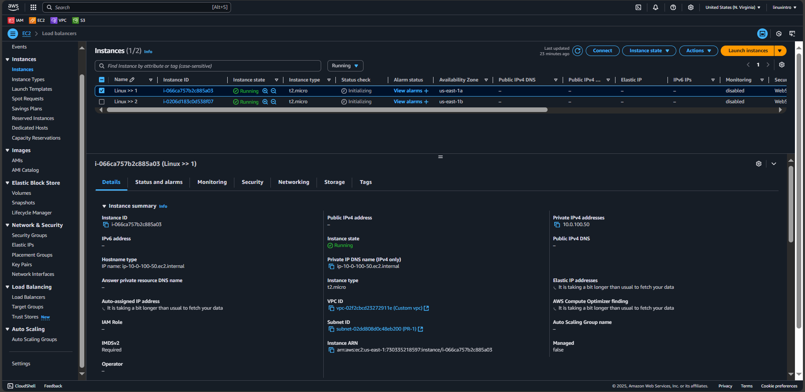
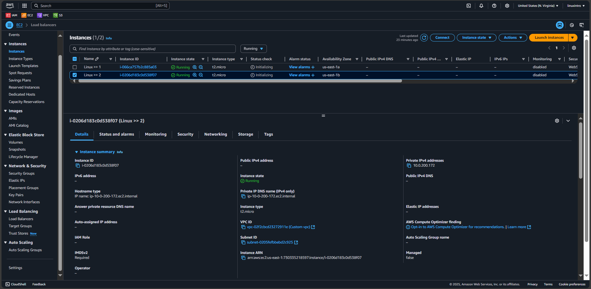

### Step 8: Configure Application Load Balancer
- Configured an ALB to distribute traffic to the instances.
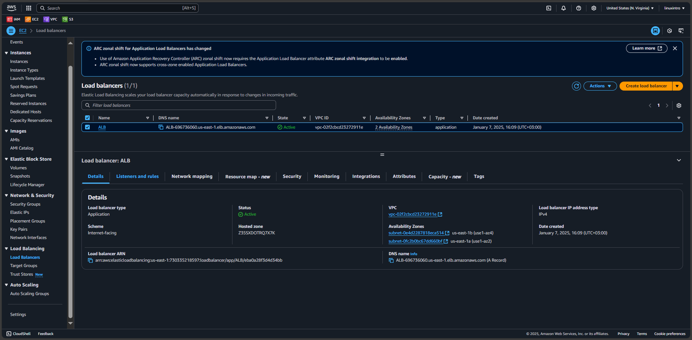

### Step 9: Create Target Groups and Auto Scaling Group
- Configured a target group and an auto-scaling group for high availability.
  - Target Group:
  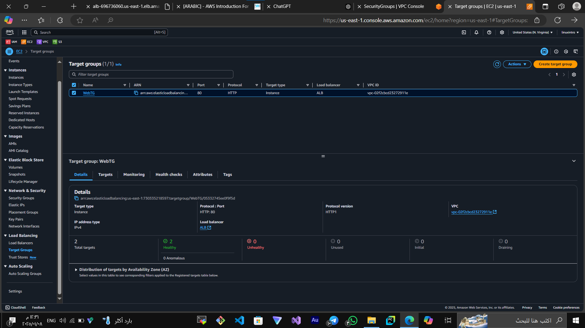
  - Auto Scaling Group:
  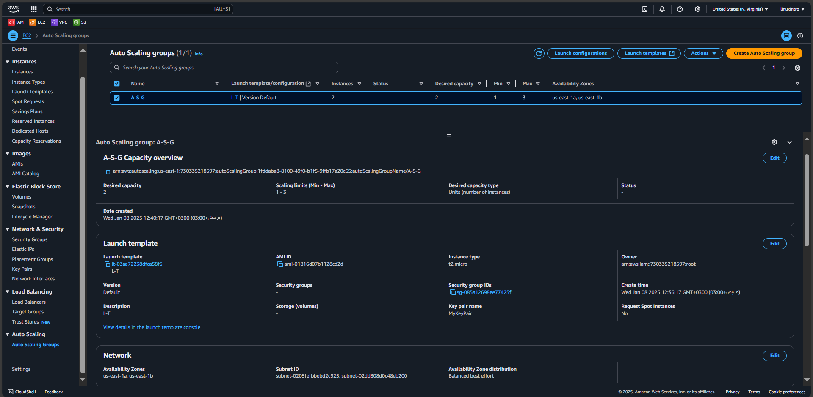

### Step 10: Launch Template for Instances
- Created a launch template for managing EC2 configurations.
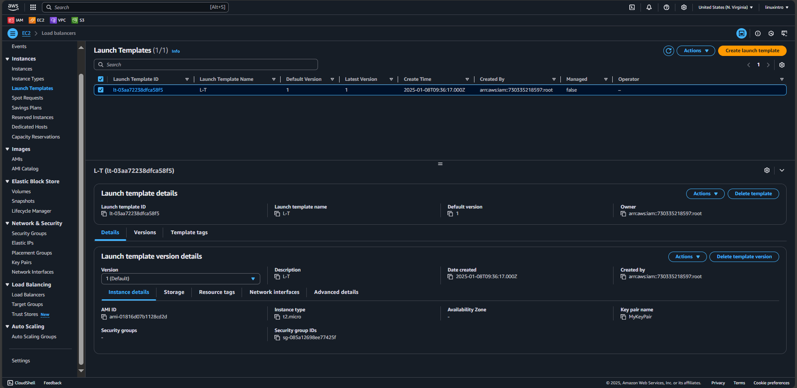

### Step 11: Test the Application
- Successfully accessed the application through the ALB DNS.
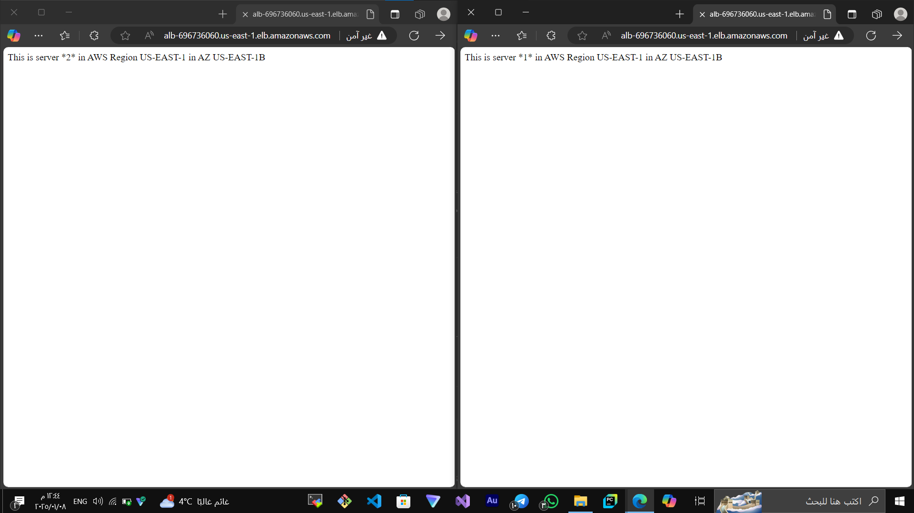

---

## How to Use
1. Clone this repository:
   ```bash
   git clone https://github.com/YourUsername/AWS-Multi-Tier-App.git
